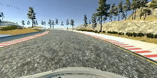

# Self Driving Car Behavioral Cloning Project

Overview
---
This project uses deep neural networks and convolutional neural networks to clone driving behavior. We trained, validated and test a model using Keras. The model output was steering angle to an autonomous vehicle. [Udacity self-driving car simulator](https://github.com/udacity/self-driving-car-sim) was used for data collection and testing.

Run: `python drive.py model.h5`

Technical details of the project can be found in this [writeup](writeup.md).
